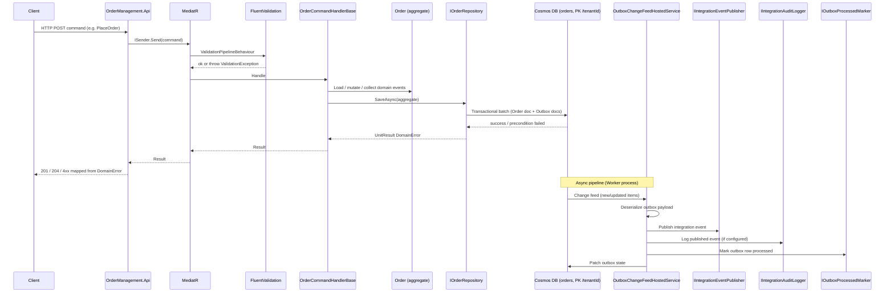
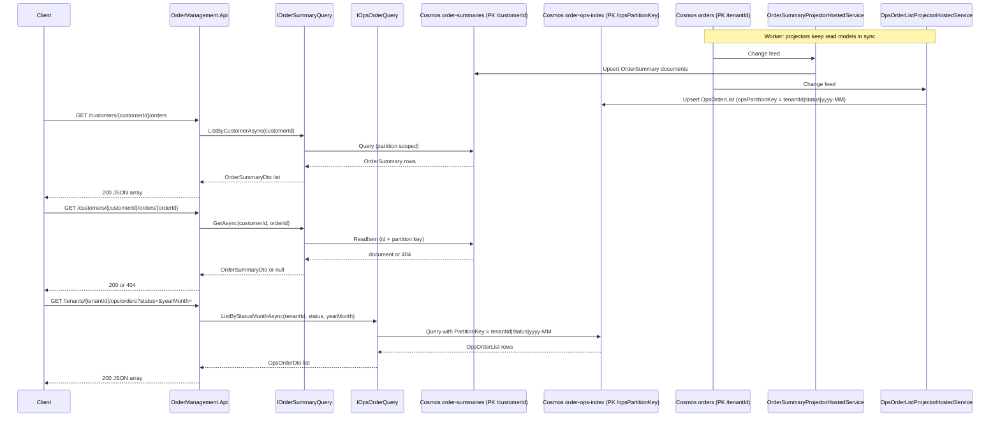
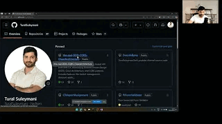
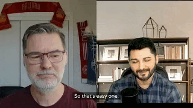
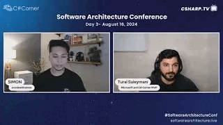
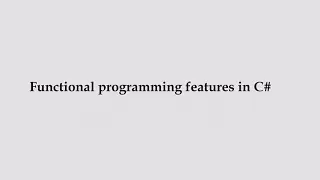
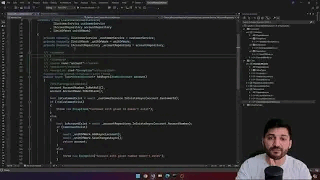

# Order Management < -- > Azure Cosmos DB Conf 2026 talk source code

> This repository contains the **source code of my international talk** at **Azure Cosmos DB Conf 2026**, where I was a speaker.  
> I prepared this real-world example to demonstrate how to build **high-scale, event-driven systems** using **Azure Cosmos DB**, and to highlight the power of Cosmos DB features like **transactional batch**, **change feed**, and partition-aware modeling.

The solution exposes an HTTP API for placing, shipping, and cancelling orders, with **customer-centric** and **operations-centric** read models.

The **Order Bounded Context** in this sample is responsible for:

- Placing new orders (writes to the aggregate store and outbox in one transactional batch)
- Cancelling and shipping existing orders
- Querying order summaries by customer (`order-summaries`, partition key `/customerId`)
- Querying operations lists by tenant, status, and month (`order-ops-index`, partition key `/opsPartitionKey` = `tenantId|status|yyyy-MM`)

This README follows the same high-level structure as [the-real-DDD-CQRS-CleanArchitecture](https://github.com/TuralSuleymani/the-real-DDD-CQRS-CleanArchitecture) (Basket API): features, architecture overview, interaction flows, DDD notes, patterns, tech stack, getting started, project layout, and usage examples.

---

## Table of Contents

- [Features](#features)
- [Clean Architecture Overview](#clean-architecture-overview)
- [Interaction Flow in DDD and Clean Architecture](#interaction-flow-in-ddd-and-clean-architecture)
- [Domain-Driven Design Principles and Patterns](#domain-driven-design-principles-and-patterns)
- [Design Patterns Used](#design-patterns-used)
- [Technologies Used](#technologies-used)
- [Getting Started](#getting-started)
  - [Prerequisites](#prerequisites)
  - [Azure Cosmos DB: databases and containers](#azure-cosmos-db-databases-and-containers)
  - [Configuration (appsettings and user secrets)](#configuration-appsettings-and-user-secrets)
  - [Run the API and Worker](#run-the-api-and-worker)
- [Project Structure](#project-structure)
- [Usage: payloads and responses](#usage-payloads-and-responses)
- [Watch and Learn](#watch-and-learn)
- [About the author](#about-the-author)
- [Contributing](#contributing)
- [License](#license)

---

## Features

- **Order lifecycle**: Place, cancel, and mark shipped (`Placed`, `Shipped`, `Cancelled`).
- **Clean Architecture**: Domain, Application, Infrastructure, API, and a separate **Worker** host for background processors.
- **CQRS**: Commands via **MediatR** (`ICommand` / handlers with **FluentValidation** pipeline behaviour).
- **Result pattern**: Expected failures use `UnitResult<DomainError>` (**CSharpFunctionalExtensions**) instead of control-flow exceptions for business and persistence errors.
- **Domain events** → **integration events**: Application layer maps domain events to integration payloads; infrastructure persists an **outbox** in Cosmos and the Worker publishes to **Azure Service Bus** (or logs if no connection string is set).
- **Transactional outbox**: Order document and outbox records are written in the **same partition** (`/tenantId`) using a transactional batch.
- **Read models**: **Change feed** projectors maintain `order-summaries` and `order-ops-index` for low-latency queries aligned to different access patterns.
- **Integration audit**: Optional Cosmos-backed audit log (`integration-log`, PK `/tenantId`).

---

## Clean Architecture Overview

**OrderManagement** is structured around **Clean Architecture**:

1. **Domain layer** (`VOEConsulting.Flame.OrderManagement.Domain`):
   - Aggregate root: `Order`.
   - Domain events: e.g. `OrderPlacedEvent`, `OrderCancelledEvent`, `OrderShippedEvent`.
   - Smart enums: `OrderStatus`.
   - Value objects: `Money` + `Currency` for monetary arithmetic and multi-currency safety.
   - Shared primitives live in `VOEConsulting.Flame.Domain.Common` (`Entity<T>`, `AggregateRoot<T>`, `Id<T>`, `DomainError`, `ErrorType`, MediatR abstractions).

2. **Application layer** (`VOEConsulting.Flame.OrderManagement.Application`):
   - Commands: `PlaceOrder`, `CancelOrder`, `MarkShipped` with validators and handlers (shared orchestration via `OrderCommandHandlerBase`).
   - Queries: `IOrderSummaryQuery`, `IOpsOrderQuery` with DTOs.
   - Integration event contracts and mapping from domain events.

3. **Infrastructure layer** (`VOEConsulting.Flame.OrderManagement.Infrastructure`):
   - Cosmos DB repositories, outbox, change feed hosted services, Service Bus publisher, optional audit logger.

4. **API layer** (`VOEConsulting.Flame.OrderManagement.Api`):
   - Minimal APIs; dispatches commands through `ISender`; maps `DomainError` to HTTP results.

5. **Worker** (`VOEConsulting.Flame.OrderManagement.Worker`):
   - **Outbox dispatcher** (`IIntegrationEventPublisher`, `IIntegrationAuditLogger`, `IOutboxProcessedMarker`).
   - **Order summary projector** and **ops list projector** (read-model builders).

---

## Interaction Flow in DDD and Clean Architecture

### Write path

The diagram below shows a **command** that changes state: HTTP request → MediatR → command handler → domain → repository → Cosmos **transactional batch** (aggregate + outbox). Publishing to Service Bus happens **asynchronously** in the Worker when the change feed processes new outbox rows.



### Read path

Reads **do not** hit the aggregate container directly for list/detail summaries. The **order-summaries** and **order-ops-index** containers are populated by **change feed projectors** running in the Worker, so read APIs see **eventually consistent** projected documents.



---

## Domain-Driven Design Principles and Patterns

1. **Entities / aggregates**: `Order` is the aggregate root; identity is `Id<Order>`.
2. **Value objects**: `Money`, `Currency`, `MoneyBreakdown`, `Percentage` encapsulate invariants and currency-safe arithmetic.
3. **Domain events**: Implement `IDomainEvent`; raised inside the aggregate and cleared after successful persistence.
4. **Repositories**: `IOrderRepository` abstracts load/save; infrastructure maps documents and uses **optimistic concurrency** (ETag) where applicable.
5. **Factories**: Aggregate creation is centralized (e.g., `Order.PlaceNew(...)`) so invariants and event-raising happen in one place.
6. **Ubiquitous language**: Order, place, cancel, ship, tenant, customer, outbox, integration event.
7. **Bounded context**: Order management is isolated; shared kernel is `VOEConsulting.Flame.Domain.Common`.

---

## Design Patterns Used

| Pattern | Role in this solution |
|--------|------------------------|
| **Adapter** | Infrastructure repositories and queries adapt external services (Cosmos SDK/Service Bus) to application interfaces (`IOrderRepository`, `IOrderSummaryQuery`, `IOpsOrderQuery`). |
| **Anti-corruption / mapping** | Domain events → integration events; Cosmos documents ↔ domain aggregates and read models. |
| **Builder** | `WebApplicationBuilder` / `HostApplicationBuilder` compose configuration and services; Cosmos transactional batch (`CreateTransactionalBatch`) builds multi-operation atomic writes; hosting helpers (`OrderManagementAzureAppConfiguration`, `AddOrderManagementPersistence`) assemble cross-cutting setup. |
| **Chain of responsibility** | MediatR behaviors (e.g., `ValidationPipelineBehaviour`) and the MediatR pipeline run requests through a chain of processing steps before the command handler runs. |
| **Change feed processor** | Multiple background processors use leases in `leases` and independently project/publish (outbox dispatcher, summaries projector, ops projector). |
| **Command** | Explicit command types (`PlaceOrderCommand`, `CancelOrderCommand`, `MarkShippedCommand`) encapsulate requests; handlers perform the operation—this is the **command** side of **CQRS**. |
| **CQRS** | Commands change state; queries read dedicated Cosmos containers / DTOs. |
| **Dependency Injection** | Composition root in `Program.cs` wires abstractions to implementations, enabling testability and replaceability. |
| **Facade** | Infrastructure hosting module (`Infrastructure/Hosting`) and `CosmosClient`/`Container` provide a simpler surface over App Configuration, Key Vault resolution, and low-level Cosmos REST/SDK details; minimal APIs group HTTP concerns behind small endpoint modules. |
| **Factory method** | Creation methods like `Money.Create(...)`, `Currency.Create(...)`, `MoneyBreakdown.Create(...)`, and `Order.PlaceNew(...)` centralize invariants and construction. |
| **Iterator** | Cosmos SDK `GetItemQueryIterator` / feed iteration; enumerating change-feed batches in hosted services walks sequences without exposing Cosmos internals to domain code. |
| **Mediator** | next level abstraction over existing types |
| **Observer** | Aggregates collect **domain events** (`RaiseDomainEvent`, `PopDomainEvents`); integration publishing reacts after persistence. Change feed processors **observe** container writes and react (projectors, outbox dispatcher). Complements **Publisher / Subscriber** for cross-boundary messaging. |
| **Options pattern** | Hosted services bind options (`OutboxChangeFeedOptions`, projector options) from configuration for clean separation of config and behavior. |
| **Publisher / Subscriber** | Integration events are published via `IIntegrationEventPublisher`; consumers subscribe externally (in Kafka/Service Bus ecosystems). In this repo the transport is Service Bus (Kafka would be another publisher strategy). |
| **Repository** | `IOrderRepository` abstracts aggregate load/save; `CosmosOrderRepository` implements persistence and transactional outbox batching behind that interface. |
| **Result** | `Result` / `UnitResult<DomainError>` for explicit expected failures (no exception-driven business flow). |
| **Singleton** | Most infrastructure services are registered as singletons (`AddSingleton`) and reused across the app lifetime (Cosmos client/containers, publishers, query services). |
| **State** | `OrderStatus` (e.g., Placed, Cancelled, Shipped) models aggregate lifecycle; `Order` methods enforce valid transitions (only placed orders may cancel or ship). |
| **Strategy** | Pluggable implementations via DI (e.g., `IIntegrationEventPublisher`, `IIntegrationAuditLogger`, `IOutboxProcessedMarker`, query interfaces). Selecting Service Bus vs logging publisher is a runtime strategy choice. |
| **Template method** | `OrderCommandHandlerBase<TCommand>` defines the command workflow skeleton; concrete handlers override only the use-case-specific step. |
| **Transactional outbox** | Atomic write of business data and messages; reliable publishing via change feed. |

---

## Technologies Used

- **C#** and **.NET 10**
- **ASP.NET Core** (minimal APIs)
- **Azure Cosmos DB** (SQL API)
- **Azure Service Bus** (optional for integration publishing)
- **MediatR**, **FluentValidation**
- **CSharpFunctionalExtensions**
- **Azure.Messaging.ServiceBus**, **Microsoft.Azure.Cosmos**

---

## Getting Started

### Prerequisites

- [.NET 10 SDK](https://dotnet.microsoft.com/download)
- An **Azure Cosmos DB** account (SQL API) — or the [Cosmos DB Emulator](https://learn.microsoft.com/azure/cosmos-db/emulator) for local development
- (Optional) **Azure Service Bus** namespace and queue (or topic) if you want real message publishing instead of the logging stub

### Azure Cosmos DB: databases and containers

1. In the [Azure Portal](https://portal.azure.com), open your Cosmos DB account (API: **Core (SQL)**).
2. Create a database (default name in code: **`orders-db`**). You can use **shared** database throughput or provision throughput per container.
3. Create the following **containers** with these **partition key paths** and **suggested** IDs (names must match configuration if you keep defaults):

| Container ID | Partition key | Purpose |
|--------------|---------------|---------|
| `orders` | `/tenantId` | Order aggregate documents and **outbox** items (same partition for transactional batch). |
| `order-summaries` | `/customerId` | Projected read model for customer APIs. |
| `order-ops-index` | `/opsPartitionKey` | Projected ops list; key value = `tenantId|status|yyyy-MM`. |
| `leases` | `/id` | Change feed lease store (default for the Cosmos DB change feed processor). |
| `integration-log` | `/tenantId` | Optional audit of published integration events. |

4. Under **Keys**, copy the **Primary Connection String** for configuration.

**Note:** Container throughput: for development, **400 RU/s** per container (or shared at database level) is often enough; tune for your load in production.

### Configuration (Azure App Configuration + Key Vault)

This solution is designed to keep **all relevant configuration** in **Azure App Configuration**, and store secrets in **Azure Key Vault** (referenced from App Configuration). Both the API and Worker load configuration at startup using `DefaultAzureCredential`.

**Bootstrap settings (local only)** live in `appsettings.json` and are intentionally minimal:

- `AppConfig:Endpoint` or `AppConfig:ConnectionString`
- `AppConfig:SentinelKey` (used for refresh)
- Non-secret defaults (container names, processor names, etc.)

Everything else (Cosmos connection string, Service Bus connection string, etc.) should come from App Configuration / Key Vault.

#### App Configuration keys (recommended)

Store these keys in **Azure App Configuration** (optionally label them with your environment name, e.g. `Development`, `Staging`, `Production`):

- `Cosmos:ConnectionString` (**secret** → use **Key Vault reference**)
- `Cosmos:DatabaseName` (e.g. `orders-db`)
- `Cosmos:OrdersContainer` (e.g. `orders`)
- `Cosmos:OrderSummariesContainer` (e.g. `order-summaries`)
- `Cosmos:OrderOpsContainer` (e.g. `order-ops-index`)
- `Cosmos:LeaseContainer` (e.g. `leases`)
- `Cosmos:IntegrationAuditContainer` (e.g. `integration-log` or empty to disable)
- `Cosmos:ChangeFeed:ProcessorName` / `Cosmos:ChangeFeed:InstanceName`
- `Cosmos:OrderSummaryFeed:ProcessorName` / `Cosmos:OrderSummaryFeed:InstanceName`
- `Cosmos:OpsOrderFeed:ProcessorName` / `Cosmos:OpsOrderFeed:InstanceName`
- `ServiceBus:ConnectionString` (**secret** → use **Key Vault reference**, optional)
- `ServiceBus:QueueOrTopicName` (e.g. `orders-integration`)
- `Settings:Sentinel` (any value; used as a refresh sentinel)

#### Azure Key Vault

Create secrets in Key Vault, for example:

- `Cosmos--ConnectionString`
- `ServiceBus--ConnectionString`

Then, in **Azure App Configuration**, create **Key Vault references** for:

- `Cosmos:ConnectionString`
- `ServiceBus:ConnectionString`

#### Local development (recommended)

Use **User Secrets** only to bootstrap connectivity to App Configuration (not to store your Cosmos/ServiceBus secrets directly):

```bash
dotnet user-secrets init --project src/VOEConsulting.Flame.OrderManagement.Api
dotnet user-secrets set "AppConfig:Endpoint" "<your-app-config-endpoint-url>" --project src/VOEConsulting.Flame.OrderManagement.Api

dotnet user-secrets init --project src/VOEConsulting.Flame.OrderManagement.Worker
dotnet user-secrets set "AppConfig:Endpoint" "<your-app-config-endpoint-url>" --project src/VOEConsulting.Flame.OrderManagement.Worker
```

Make sure you are authenticated for `DefaultAzureCredential` (e.g. `az login`) and your identity has access to App Configuration and Key Vault.

### Run the API and Worker

Run **both** processes: the API serves HTTP; the Worker runs change feed processors (outbox dispatch, summary projection, ops projection).

**Terminal 1 — API** (default HTTP URL from `launchSettings.json`: `http://localhost:5062`):

```bash
dotnet run --project src/VOEConsulting.Flame.OrderManagement.Api
```

**Terminal 2 — Worker**:

```bash
dotnet run --project src/VOEConsulting.Flame.OrderManagement.Worker
```

Build the full solution:

```bash
dotnet build OrderManagement.sln
```

---

## Project Structure

```
├── OrderManagement.sln
├── src/
│   ├── VOEConsulting.Flame.Domain.Common/          # Shared DDD primitives (Entity, Id, Result errors, ICommand/IQuery)
│   ├── VOEConsulting.Flame.OrderManagement.Domain/
│   ├── VOEConsulting.Flame.OrderManagement.Application/
│   ├── VOEConsulting.Flame.OrderManagement.Infrastructure/
│   ├── VOEConsulting.Flame.OrderManagement.Api/
│   └── VOEConsulting.Flame.OrderManagement.Worker/
└── README.md
```

---

## Usage: payloads and responses

JSON uses **camelCase** property names by default. Replace GUIDs and IDs with your own values.

### Write: place an order

The domain models money as value objects (`Money`, `Currency`) and persists a pricing breakdown:

\[
\text{Total} = \text{Subtotal} - \text{Discount} + \text{Tax}
\]

**Request**

`POST /orders`

`Content-Type: application/json`

```json
{
  "tenantId": "tenant-001",
  "orderId": "550e8400-e29b-41d4-a716-446655440000",
  "customerId": "cust-123",
  "subtotalAmount": 180.00,
  "discountAmount": 10.00,
  "taxAmount": 29.99,
  "totalAmount": 199.99,
  "currency": "USD"
}
```

**Responses**

- **201 Created** — body echoes the main fields; `Location` header points to the customer order resource.

```http
HTTP/1.1 201 Created
Location: /customers/cust-123/orders/550e8400-e29b-41d4-a716-446655440000
```

```json
{
  "tenantId": "tenant-001",
  "orderId": "550e8400-e29b-41d4-a716-446655440000",
  "customerId": "cust-123",
  "subtotalAmount": 180.00,
  "discountAmount": 10.00,
  "taxAmount": 29.99,
  "totalAmount": 199.99,
  "currency": "USD"
}
```

- **409 Conflict** — duplicate `orderId` in the same tenant, or optimistic concurrency failure on update.

- **400 Bad Request** — business rule failure mapped to `DomainError.BadRequest`:

```json
{
  "error": "Invalid request or parameters."
}
```

(Exact `error` text depends on the message returned from the domain/application layer.)

- **500** — unhandled failures; **FluentValidation** failures currently throw `ValidationException` before the handler (consider adding exception middleware to map to 400 in production).

---

### Write: cancel an order

**Request**

`POST /tenants/{tenantId}/orders/{orderId}/cancel`

No body.

**Responses**

- **204 No Content** — success.

- **404 Not Found** — order does not exist for that tenant.

- **400 Bad Request** — e.g. order is not in `Placed` state:

```json
{
  "error": "Only placed orders can be cancelled."
}
```

- **409 Conflict** — Cosmos concurrency / precondition failure when saving.

---

### Write: mark shipped

**Request**

`POST /tenants/{tenantId}/orders/{orderId}/ship`

No body.

**Responses**

- **204 No Content** — success.

- **404** / **400** / **409** — same semantics as cancel (400 when the order is not `Placed`).

---

### Read: list orders for a customer

**Request**

`GET /customers/{customerId}/orders`

Example: `GET http://localhost:5062/customers/cust-123/orders`

**Response 200 OK**

Array of summaries (after the **Worker** projector has processed the change feed — may be **empty or stale** for a short interval after a write):

```json
[
  {
    "orderId": "550e8400-e29b-41d4-a716-446655440000",
    "customerId": "cust-123",
    "tenantId": "tenant-001",
    "status": "Placed",
    "updatedAt": "2026-04-06T12:00:00+00:00",
    "placedAt": "2026-04-06T12:00:00+00:00"
  }
]
```

`status` is one of: `Placed`, `Shipped`, `Cancelled`.

---

### Read: get one order summary for a customer

**Request**

`GET /customers/{customerId}/orders/{orderId}`

**Response 200 OK**

```json
{
  "orderId": "550e8400-e29b-41d4-a716-446655440000",
  "customerId": "cust-123",
  "tenantId": "tenant-001",
  "status": "Placed",
  "updatedAt": "2026-04-06T12:00:00+00:00",
  "placedAt": "2026-04-06T12:00:00+00:00"
}
```

**Response 404 Not Found** — no projected document yet, or unknown id.

---

### Read: operations list by tenant, status, and month

**Request**

`GET /tenants/{tenantId}/ops/orders?status={status}&yearMonth={yyyy-MM}`

Both query parameters are **required** (case-sensitive names as in code: `status`, `yearMonth`).

Example:

`GET http://localhost:5062/tenants/tenant-001/ops/orders?status=Placed&yearMonth=2026-04`

**Response 200 OK**

```json
[
  {
    "orderId": "550e8400-e29b-41d4-a716-446655440000",
    "tenantId": "tenant-001",
    "customerId": "cust-123",
    "status": "Placed",
    "yearMonth": "2026-04",
    "opsPartitionKey": "tenant-001|Placed|2026-04",
    "placedAt": "2026-04-06T12:00:00+00:00",
    "updatedAt": "2026-04-06T12:00:00+00:00"
  }
]
```

**Response 400 Bad Request** — missing `status` or `yearMonth`:

```json
{
  "error": "Query parameters status and yearMonth (yyyy-MM) are required."
}
```

---

## 🎥 Watch and Learn

To better understand Domain-Driven Design (DDD), Clean Architecture, and the concepts mentioned in this repository, check out these related videos from my YouTube channel:

1. **Video explanation of current github repo with details!**  
   
   [](https://youtu.be/TjoNaJ7n4Vg?si=bSOvy9E6wEO4-wGV)  
   *Learn more about current github repository; I'm explanation DDD(Domain-driven Design) and Clean Architecture behind this github project.*

2. **Podcast with Robert C. Martin: The Creator of Clean Architecture and SOLID Principles**  
   
   [](https://youtu.be/xNgXAQjICpQ?si=HbPefWtLg4F2vzqC)  
   *In this episode, I sit down with Robert C. Martin (Uncle Bob), the legendary author of Clean Code and Clean Architecture and creator of the SOLID principles, to explore Object-Oriented Programming, software design, and the future of development.*

3. **Podcast with Mads Torgersen: The Man Behind the C# Language**  
   
   [](https://youtu.be/2OSc8saeekM?si=Dy51ukYgJxOu016i)  
   *Explore the evolution of C#, its features, and its application in modern software development with the Lead Designer of C# language and of course, with me :).*

4. **Podcast with Rebecca Wirfs-Brock: The Creator of Responsibility-Driven Design**  
   
   [](https://youtu.be/Oi1UOnCfxJo?si=WgYza3vulLrbXJE4)  
   *In this podcast, I had the privilege to host legendary Rebecca Wirfs-Brock, where we discussed about Domain-Driven Design, Responsibility-driven design, and design heuristics.*

5. **A Deep Dive into Architecture, Functional Programming, and Dependency Injection with Mark Seemann**  
   
   [](https://youtu.be/aBtMvQdb3vs?si=tHbKd6ME72I-AVmz)  
   *In this episode, I chat with renowned software architect Mark Seemann about modern software development, covering topics like well-designed architecture, Dependency Injection, and functional programming.*

6. **An Elegant Introduction to Domain-Driven Design (DDD) and Its Patterns**  
   
   [](https://youtu.be/aBtMvQdb3vs?si=tHbKd6ME72I-AVmz)  
   *My speech at Software Architecture Conference, where I provided an overview of DDD principles, their patterns, and how they can be applied in real-world projects.*

7. **Functional programming in C# with Railway-Oriented Programming**  
   
   [](https://youtu.be/Pq4XLWxt-T8?si=pjzKQd1u9T9OJjX4)  
      *A detailed explanation of Functional Programming in C#, its use cases,values, and implementation using Railway-Oriented programming*

8. **Master the Result Pattern: The One Video You Must Watch**  
   
   [](https://youtu.be/Pq4XLWxt-T8?si=pjzKQd1u9T9OJjX4)  
   *A detailed explanation of the Result pattern, its use cases, and implementation in C# projects.*

---

## About the author

Author of the book [Hands-on Microservices with JavaScript](https://www.packtpub.com/) published by Packt

Author of the [Apache Kafka for Distributed Systems](https://www.udemy.com/course/apache-kafka-for-distributed-systems) course on Udemy

Creator of a [TuralSuleymaniTech youtube channel](https://www.youtube.com/@turalsuleymanitech) with 12K+ subscribers, where I host discussions with leading figures in software engineering such as Robert C. Martin, Grady Booch, Bertrand Meyer,Mads Torgersen, Jon Skeet,  Rebecca Wirfs-Brock, Mark Seemann and others

[2x Microsoft MVP](https://mvp.microsoft.com/en-US/MVP/profile/03714279-cac2-4e47-8b00-a57f71efc528) in C# and Web Technologies (the first and the only from my country)

3x [C# Corner MVP](https://www.c-sharpcorner.com/members/tural-suleymani)

Public speaker at multiple international conferences, including [Microsoft](https://developer.azurecosmosdb.com/speakers/) and [C# Corner](https://youtu.be/aBtMvQdb3vs?si=sllWQq_AVcxMkAB2) events.

Open-source contributor with publicly available projects on [GitHub](https://github.com/TuralSuleymani/)

Trained 500+ students, many of whom now work at leading companies, major banks and insurance companies.

Holder of [multiple Microsoft certifications](https://www.credly.com/users/tural-suleymani/badges#credly), including MCP, MCSA, and MCSD

I'm a [Microsoft Certified Trainer (MCT)](https://www.credly.com/users/tural-suleymani/badges)

15 years of experience in software development

---

## Contributing

1. Fork or branch from your team’s mainline.
2. Create a feature branch (`feature/your-feature`).
3. Commit changes with clear messages.
4. Open a pull request describing behaviour and any Cosmos or Service Bus configuration changes.

---

## Related material

For a broader discussion of DDD, CQRS, and Clean Architecture in C#, see the companion sample: **[the-real-DDD-CQRS-CleanArchitecture](https://github.com/TuralSuleymani/the-real-DDD-CQRS-CleanArchitecture)**.

---

## License

This project is free and open for use. Feel free to download, explore, modify, and use it in your own projects.
